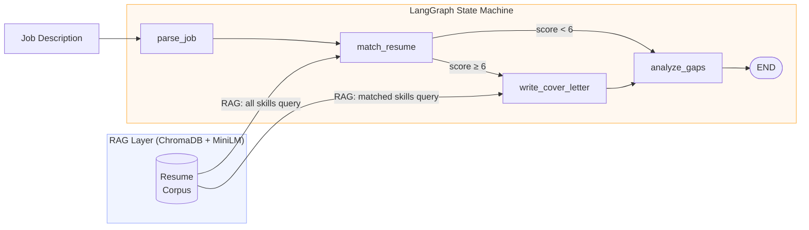
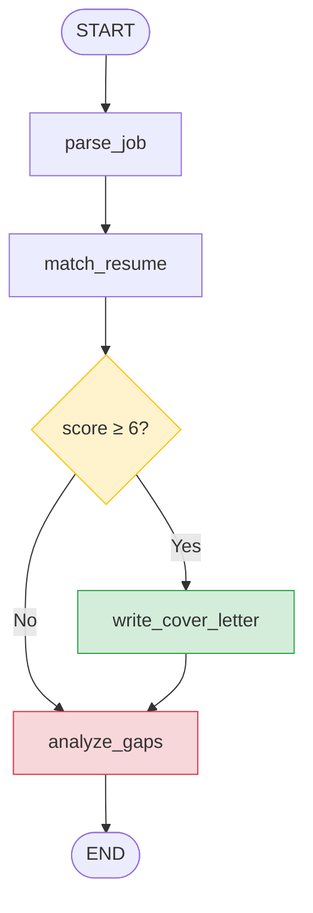

# HireAgent

An AI-powered hiring assistant that parses job postings, scores resume fit, drafts cover letters, and identifies skill gaps — all orchestrated through a LangGraph state machine with a ChromaDB-backed RAG pipeline.

---

## Architecture



**State flows left to right through four nodes.** The conditional edge after `match_resume` is the only branch point: strong candidates (score ≥ 6) get a cover letter drafted before gap analysis runs; weaker candidates skip straight to gap analysis.

---

## How it works

### RAG Pipeline

Resumes are loaded from PDF, split into overlapping chunks, and embedded with `sentence-transformers/all-MiniLM-L6-v2`. Embeddings are stored in a local ChromaDB collection. At query time, relevant chunks are retrieved by cosine similarity and passed as context to Claude.

Two separate retrievals happen inside the graph:
- **`match_resume`** queries with all required skills to get the broadest coverage for scoring.
- **`write_cover_letter`** queries with only the *matched* skills to surface achievement evidence — the query is targeted at what the candidate already has, not what they lack.

### Multi-Agent Design

Each LangGraph node is a single-responsibility agent:

| Node | Input | Output | LLM? |
|---|---|---|---|
| `parse_job` | raw job text | structured `requirements` dict | Yes — forced `tool_use` |
| `match_resume` | requirements + resume chunks | `match_score`, `matched_skills` | Yes — scored 1–10 |
| `write_cover_letter` | requirements + matched skills + chunks | `cover_letter` prose | Yes — free text |
| `analyze_gaps` | requirements + matched_skills | `gaps` list with severity + suggestions | Partial — set difference is deterministic; LLM only for suggestions |

The graph compiles once per process and is reused across calls. Results are cached on disk keyed by `sha256(resume_hash + job_text)` — identical inputs return instantly with no API calls.

---

## Tech stack

- **LangGraph** — state machine orchestration, conditional routing, node isolation
- **LangChain** — document loaders, text splitters, ChromaDB integration
- **ChromaDB** — local vector store for resume embeddings
- **`sentence-transformers/all-MiniLM-L6-v2`** — fast, local embedding model (no API cost)
- **Anthropic Claude (Sonnet 4.6)** — LLM backend for all four nodes
- **Pydantic v2** — structured output schemas (tool_use input_schema)
- **Streamlit** — recruiter-facing UI
- **`python-dotenv`** — API key management

---

## Setup

```bash
# 1. Clone and install in editable mode
git clone https://github.com/your-username/hireagent.git
cd hireagent
pip install -e ".[dev]"

# 2. Add your API key
cp .env.example .env
# edit .env and set ANTHROPIC_API_KEY=sk-ant-...

# 3. Run the app
streamlit run src/hireagent/ui/app.py
```

---

## Screenshot

> _Screenshot coming soon — upload your resume and paste a job description to see the live analysis._

---

## Design decisions

### 1. LangGraph (graph-based state machine) over ReAct orchestration

**Decision:** Orchestrate nodes as an explicit compiled graph with a typed state machine.

**Alternatives considered:**
- *ReAct loop* — the LLM decides the next action at runtime based on the previous output.
- *Simple chain* — nodes are called sequentially with no branching.

**Why this choice:** ReAct introduces non-determinism into a fundamentally deterministic workflow. The sequence `parse → match → (maybe) write → analyze` is fixed; the only variable is whether the candidate clears the score threshold. Spending LLM tokens to decide what to do next — when that decision is a single integer comparison — adds latency and failure modes without any benefit. The graph encodes routing explicitly; LLM tokens are spent on analysis, not on deciding what to analyze.

A simple chain was rejected because downstream nodes depend on upstream quality. A bad parse shouldn't silently propagate into scoring and cover letter drafting. LangGraph's conditional edges enable score-based routing — a weak candidate goes straight to gap analysis without wasting tokens on a cover letter. That branch is unreachable in a plain chain.



---

### 2. TypedDict over dataclass for agent state

**Decision:** Define `HireAgentState` as a `TypedDict`, not a `@dataclass`.

**Alternatives considered:** `@dataclass`, `pydantic.BaseModel`.

**Why this choice:** LangGraph merges node outputs into the running state by calling `dict.update(node_output)`. Each node returns only the fields it changed — a partial dict. TypedDict is a plain `dict` at runtime, so this merge works with no special handling. A dataclass is not a dict: LangGraph would have to reconstruct it after every node, which requires every node to return a full object and copy every field it didn't touch — boilerplate that scales with state width. TypedDict annotations are erased at runtime: zero overhead, no `__init__`, no descriptor machinery.

---

### 3. Forced `tool_use` for structured LLM output

**Decision:** All nodes that need structured output define a Pydantic model, derive a JSON Schema from it, and call Claude with `tool_choice={"type": "tool", "name": ...}`.

**Alternatives considered:** JSON mode (unavailable in Claude), regex extraction from free text, prompt-instructed JSON with post-processing.

**Why this choice:** Claude has no JSON mode. Prompt-instructed JSON is brittle — the model can deviate from the schema, include prose before the JSON block, or produce trailing commas. Regex extraction is fragile and schema-unaware. Defining a tool whose `input_schema` matches a Pydantic model guarantees the response is valid JSON that conforms to the schema before it reaches application code. There is no parsing step — Claude's response is deserialized directly by the Pydantic model. The Pydantic model becomes the single source of truth: it defines the schema, drives the API call, and handles deserialization.

---

### 4. Different RAG queries for matcher vs writer

**Decision:** `match_resume` and `write_cover_letter` issue different queries against the same vector store.

**Alternatives considered:** One shared retrieval result reused by both nodes; a single broad query at graph entry.

**Why this choice:** The two nodes have different information needs. The matcher needs *breadth*: "does this person have these skills?" — so it queries with all required skills to ensure no relevant resume section is missed during scoring. The writer needs *depth*: "what specific achievements can I reference?" — so it queries with only the matched skills, steering the retriever toward impact statements, metrics, and project outcomes rather than skill-list sections. Using the same query for both would either over-fetch for the writer (noisy context) or under-fetch for the matcher (missed skills). RAG retrieval is not one-size-fits-all; the query is the primary lever for controlling what gets surfaced.

---

### 5. Sentence-shaped RAG queries over keyword lists

**Decision:** Retrieval queries are written as natural sentences ("candidate with experience in X, Y, and Z") rather than comma-separated keyword lists.

**Alternatives considered:** Joining skill terms with commas; querying each skill individually.

**Why this choice:** `all-MiniLM-L6-v2` was fine-tuned on sentence pairs — it encodes meaning by comparing full sentences against each other. A comma-separated keyword list produces a degenerate embedding because it has no syntactic structure to anchor the model's attention. A sentence-shaped query occupies a more specific region of the embedding space and retrieves resume sections that are themselves written in sentence form (experience descriptions, achievement bullets), not just skill headers. Querying each skill individually was rejected because it multiplies API surface area and breaks the semantic relationship between co-occurring skills.

---

### 6. Deterministic classification, LLM-powered analysis

**Decision:** Gap severity is computed from two deterministic inputs; the LLM only adds qualitative analysis on top.

**Alternatives considered:** Ask the LLM to classify severity directly; use only vector similarity without the must-have/nice-to-have distinction.

**Why this choice:** Gap severity has two clean inputs: whether the skill is must-have or nice-to-have (from the structured parser output) and the vector similarity score from a targeted RAG probe. Both are deterministic and auditable. Delegating that classification to an LLM introduces hallucination risk — the model might decide a missing must-have skill is "probably fine" based on adjacent context. Deterministic classification means the same inputs always produce the same severity label: the logic is testable, the output is explainable, and recruiters can trust that "critical gap" means the same thing every run. The LLM adds qualitative analysis on top — remediation suggestions, framing, nuance — where language ability actually matters.

---

### 7. Error propagation via state field, not exceptions

**Decision:** Node failures write to `state["error"]` and return early. Downstream nodes check this field and short-circuit. No node raises an unhandled exception.

**Alternatives considered:** Raising exceptions and letting LangGraph catch them; returning `None` for failed fields.

**Why this choice:** Raising an exception inside a LangGraph node unwinds the graph and discards the state accumulated up to that point. Writing the error into the state field preserves the full snapshot — which fields were populated, what the parse produced, what score was assigned — making post-mortem debugging tractable. It also plays well with LangGraph's checkpointing: a failed run's state can be inspected, patched, and resumed. `None` fields were rejected because they conflate "not yet computed" with "failed to compute" — a distinction that matters when deciding whether to retry.

---

## Future improvements

- **Semantic LLM response caching** — the current disk cache uses an exact SHA256 key (resume hash + job text); extend it to match by embedding similarity so near-duplicate job descriptions hit the cache. Note: Anthropic prompt caching (`cache_control: ephemeral`) is already in place for system prompts and RAG context blocks — this is a separate, higher-level cache for full analysis results.
- **Per-skill RAG probing** — issue one targeted retrieval per required skill instead of a single bulk query; improves recall for candidates whose skills are scattered across resume sections.
- **Query expansion for skill synonyms** — before retrieval, expand skill terms to known synonyms and aliases (e.g. "ML" → "machine learning, deep learning, model training") so the vector search is not sensitive to terminology mismatch between the job posting and the resume.
- **Parent-document retrieval** — store fine-grained chunks for embedding but retrieve the enclosing parent section for context; prevents the LLM from receiving a fragment mid-sentence with missing setup.
- **Model routing** — use Haiku for high-volume, low-complexity nodes (parsing, set-difference gap detection) and Sonnet for nodes where reasoning quality matters (scoring, cover letter drafting); reduces cost without degrading output quality on the critical path.
